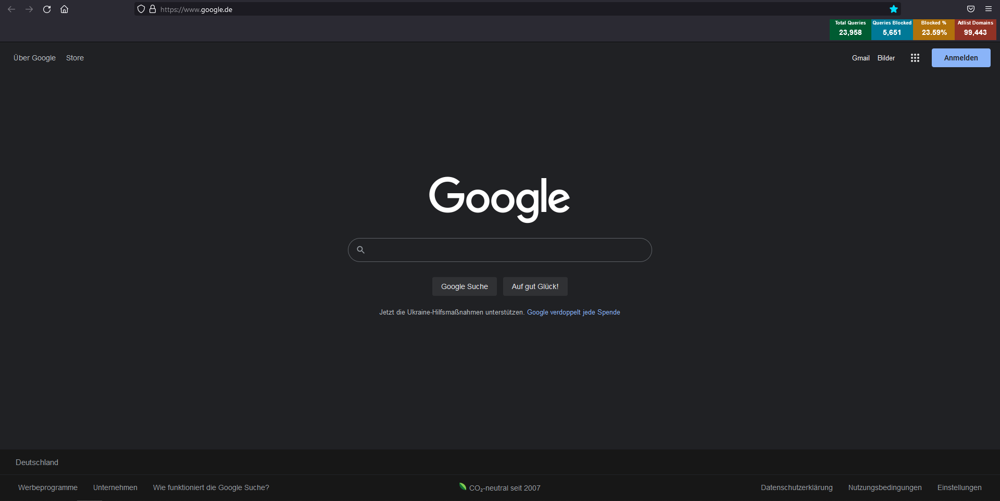

# PiHoleStatus
A small extension for firefox to always show pi-hole's statistics in the browser ui.

## Installation

1. Download the files [piholestatus-1.0-an+fx.xpi](./piholestatus-1.0-an+fx.xpi) and [userChrome.css](./userChrome.css)
1. Open the manage addons page in firefox (e. g. type `about:addons` in the url bar)
2. Select "Install Add-on From File..." and select the .xpi file.
3. Open your firefox profile folder in the file browser. An easy way to get there is by going to *Help &rarr; More Troubleshooting Information*, then click on *Open Folder* in the *Profile Folder* row. Or navigate there manually. On window it is usually in this location: 
`C:\Users\<yourUserName>\AppData\Roaming\Mozilla\Firefox\Profiles\<yourProfileName>`
5. Create a folder named `chrome` if if doesn't exist already. Then place the userChrome.css file there (don't rename it). 
6. Restart firefox.

By default the panel is placed in the bookmarks bar, but you can move it around after installation just like any other extension icon.

## How Does It Work?

The panel, that shows the statistics, is basically an extension icon. A lot of extensions add one of these to the menu bar when installed. The catch is that firefox requires them to be square. Different image dimensions are supported (e.g. 16x16, 32x32, 64x64, ...) buy the width must always match the height or the extension's validation will fail.

It is actually possible to install an extension temporarily, which gets removed as soon as the browser is closed. While the image aspect ratio is not checked when adding the extension that way, adding the extension each time the browser is opened doesn't seem fun at all.

So what do we do? It turns out that you can still set arbitrarily sized icons at runtime with javascript. We just omit the initial icon and set it dynamically. Every few seconds the Pi-hole api is queried to get recent data. This data is then used to create a canvas, which is then set as the icon source. This is done in [updatePiHoleStatusIcon.js](./updatePiHoleStatusIcon.js), which runs in the background.

By default, it is not possible to query the Pi-hole api from an extension's background script. The CORS *Access-Control-Allow-Origin* header on the lighttpd server is missing or at least set too restrictive for our purpose. [Extensions get their own origin](https://developer.mozilla.org/en-US/docs/Mozilla/Add-ons/WebExtensions/manifest.json/permissions#host_permissions), which looks something like `moz-extension://60a20a9b-1ad4-af49-9b6c-c64c98c37920/`. Since the server doesn't like that, the workaround is to require the permission for the pattern `"*://pi.hole/admin/*"` in the manifest file. This allows the extension to set the same origin as the admin panel does and we can sucessfully query the api.

But there is one more problem to solve. While it is possible to style any website through CSS however you like, this is not the case for the firefox browser ui (e.g. the menubar). We were able to set an image with arbitrary size, but that doesn't do much if the surrounding button element is too small to show the whole image. Maybe even the whole toolbar is not high enough for that. Our image would simply be cropped off.

This is where the file [userChrome.css](./userChrome.css) comes into play. By placing it in the correct location we are able to overwrite the firefox ui styles and extend the button to match the image size.

## Resources

Of course you are free to modify the source code to fit your needs. I just wrote this on a whim and might or might not extend it in the future...

If you decide to dig deeper, here are some resources that might come in handy:

- [Firefox browser extension reference](https://developer.mozilla.org/en-US/docs/Mozilla/Add-ons/WebExtensions)
- [How to install an extension temporary](https://extensionworkshop.com/documentation/develop/temporary-installation-in-firefox/) (useful for testing)
- There doesn't seem to be a comprehensive list of firefox ui css selectors (if you find one let me know please). The best way to figure out how to address elements is to use the inspector tool in the developer console. The catch being that you can't use it for firefox ui elements by default. See [here](https://developer.mozilla.org/en-US/docs/Tools/Browser_Toolbox) how to enable this feature.
- If you modified the extension you have to build it and sign it with the [web-ext tool](https://extensionworkshop.com/documentation/develop/web-ext-command-reference/) using your own firefox account (after creating api credentials). Then install it from the xpi file to enable it permanently. 
- [Pi-hole API](https://discourse.pi-hole.net/t/pi-hole-api/1863) and [example request](http://pi.hole/admin/api.php?summaryRaw) (the one one send internally by the extension)
